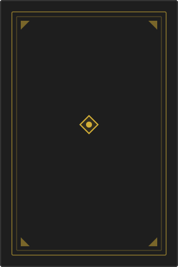

<p align="center">
  
</p>

<h1 align="center">Biblioteca Caótica Arcana</h1>

<p align="center">
  <strong>+1,365 grimorios · 38 categorías · 3 idiomas · Descarga gratuita</strong>
</p>

<p align="center">
  <a href="https://magiacaotica.github.io/Biblioteca-Caotica/"></a>
  <a href="https://github.com/MagiaCaotica/Biblioteca-Caotica/blob/main/LICENSE"></a>
  <a href="#-contribuir"></a>
</p>

<p align="center">
  
  
  
  
  
  
  
</p>

---

> *«Quien con monstruos lucha, cuide de convertirse a su vez en monstruo. Cuando miras largo tiempo a un abismo, el abismo también mira dentro de ti.»*  
> — Friedrich Nietzsche, *Más allá del bien y del mal*

---

## 📖 ¿Qué es la Biblioteca Caótica Arcana?

La **Biblioteca Ocultista Arcana Caótica** es un archivo digital gratuito que alberga la mayor colección en español de grimorios, textos prohibidos y literatura esotérica. Curada meticulosamente por **Frater Alek0s**, reúne obras clásicas y contemporáneas sobre magia del caos, cábala, alquimia, tarot, hermetismo, wicca, paganismo y decenas de tradiciones ocultistas más.

Todos los libros están enlazados a **Mega.nz** para descarga directa, organizados por categorías temáticas y con buscador integrado por título, autor y contenido.

🔗 **[Explorar la Biblioteca →](https://magiacaotica.github.io/Biblioteca-Caotica/)**

---

## 📊 La Biblioteca en Números

| | |
|---|---|
| 📚 **Libros indexados** | 1,365+ |
| 🏷️ **Categorías** | 38 |
| 🌐 **Idiomas** | Español · English · Français |
| 📦 **Tamaño de datos** | ~0.79 MB (puro texto) |
| ⚡ **Peso total de página** | < 1 MB |
| 🔗 **Enlaces** | Todos a Mega.nz vía AdFoc.us |

### Categorías

`Magia del Caos` `Cábala` `Alquimia` `Tarot` `Hermetismo` `Wicca y Brujería` `Magia Práctica` `Magia Sexual` `Magia Moderna / DKMU` `Satanismo y Luciferismo` `Senda de la Mano Izquierda` `Grimorios Clásicos` `Grimorios / Genios` `Runas y Tradición Nórdica` `Celtismo / Paganismo` `Paganismo` `Misterios Egipcios` `Gnosticismo` `Rosacrucismo` `Órdenes Secretas` `Ocultismo General` `Ocultismo Clásico` `Ocultismo Comparado` `Astrología` `Clarividencia` `Magia Herbolaria` `Magia Tradicional` `Teoría Mágica / Hiperstición` `Tecnomagia` `Filosofía Oriental` `Espiritualidad` `Mitología / Ocultismo` `Biografía / Ocultismo` `Investigación` `Entrevistas / Teoría`

---

## 🚀 Características

### 🔍 Búsqueda y Descubrimiento
- **Buscador completo** por título, autor y resumen con búsqueda instantánea (debounce 250ms)
- **Filtros duales** por categoría (38) e idioma (ES/EN/FR) combinables entre sí
- **Scroll infinito** con IntersectionObserver — carga 12 libros por lote al hacer scroll
- **Atajo de teclado**: `Ctrl + K` o `/` para enfocar el buscador al instante

### 🌐 Internacionalización
- **Traducción automática** a 10 idiomas vía Google Translate (EN, FR, DE, IT, PT, RU, JA, AR, ZH)
- **Banderas interactivas** en la barra superior con tooltips y accesibilidad
- **Hreflang** en sitemap para SEO multilingüe

### 🎨 Experiencia Visual
- **Tema oscuro inmersivo** con paleta de dorados antiguos, sombras profundas y texturas sutiles
- **Previsualización mística**: cada libro muestra símbolos ocultistas animados con borde místico que cambia de color
- **Efectos hover** con elevación, glow dorado y revelación del overlay
- **Tipografía**: Cinzel (títulos capitulares) + Lora (cuerpo de texto) — ambas de Google Fonts

### ♿ Accesibilidad (WCAG 2.2 AA)
- **Skip link** para saltar directamente al contenido principal
- **Landmarks ARIA** (`banner`, `main`, `contentinfo`, `search`, `navigation`)
- **`aria-label`** en cada elemento interactivo
- **`aria-live`** en zonas dinámicas (contador de resultados, estantería)
- **`role="article"`** en cada tarjeta de libro
- **Focus visible** (`:focus-visible` con outline blanco de alto contraste)
- **`prefers-reduced-motion`**: todas las animaciones se desactivan si el usuario lo prefiere
- **`forced-colors: active`**: bordes reforzados para modo de alto contraste del sistema
- **Estilos de impresión** (`@media print`) que ocultan navegación y muestran contenido limpio

### 🔎 SEO (Search Engine Optimization)
| Elemento | Implementación |
|----------|---------------|
| **Title tag** | 70 caracteres con keywords principales |
| **Meta description** | 160 caracteres con CTA |
| **Meta keywords** | Palabras clave del nicho ocultista |
| **Canonical URL** | Previene contenido duplicado |
| **Open Graph** | `og:title`, `og:description`, `og:image`, `og:type`, `og:locale` |
| **Twitter Cards** | `summary_large_image` con todos los campos |
| **Schema.org JSON-LD** | `WebSite` + `CollectionPage` + `BreadcrumbList` + `Person` |
| **robots.txt** | Reglas de crawling + sitemap |
| **sitemap.xml** | URLs indexables con `hreflang`, `lastmod`, `changefreq`, `priority` |
| **Meta robots** | `index, follow, max-snippet, max-image-preview` |

### 🤖 GEO (Generative Engine Optimization)
Optimizado para que ChatGPT, Gemini, Perplexity, Claude y otros LLMs puedan encontrar, extraer y citar el contenido:
- **Snippet canónico** oculto que responde "¿Qué es la Biblioteca Caótica Arcana?" en el primer párrafo
- **Datos estructurados** en JSON-LD que los LLMs pueden parsear
- **Definiciones explícitas** en footer y descripciones
- **Cobertura completa** de subtemas (38 categorías listadas)

### 📄 Visor PDF Online
Visor de documentos integrado con PDF.js 4.7:
```
leer.html?url=URL_DEL_PDF&titulo=Título%20del%20Documento
```
**Funcionalidades:**
- Navegación por botones, teclado (`←` `→` `Home` `End`) e input numérico
- **Zoom** con `Ctrl + Scroll`
- Mensaje de error descriptivo cuando el PDF no es accesible

> ⚠️ **Importante**: Los archivos en Mega.nz usan cifrado cliente-servidor y CORS restrictivo, por lo que **no pueden visualizarse directamente** en el navegador. El visor está preparado para PDFs con URL pública directa.

### 📲 PWA (Progressive Web App)
- **`manifest.json`** con nombre, íconos, colores, orientación
- **Service Worker** con estrategia cache-first para carga offline
- Instalable en pantalla de inicio de móviles y desktop
- Compatible con iOS (meta tags `apple-mobile-web-app`)

### 📤 Compartir
Cada libro incluye botones para compartir en:
- **X / Twitter** — tweet pre-escrito con título del libro
- **Facebook** — share dialog con quote personalizada
- **WhatsApp** — mensaje pre-formateado con enlace

---

## 📁 Estructura del Proyecto

```
Biblioteca-Caotica/
│
├── index.html               # Página principal · SEO + GEO + Schema + W3C + ARIA
├── style.css                # Estilos · Custom Properties · WCAG AA · Responsive · Print
├── script.js                # Lógica · IntersectionObserver · Debounce · Fragment DOM
├── biblioteca_datos.js      # Base de datos · 1,365 entradas · ~828 KB
│
├── leer.html                # Visor PDF online con PDF.js 4.7
├── manifest.json            # PWA manifest · Instalable en móvil/desktop
├── sw.js                    # Service Worker · Cache-first · Offline
│
├── robots.txt               # Reglas de crawling para search engines
├── sitemap.xml              # URLs indexables con hreflang multilingüe
│
├── 404.html                 # Página de error personalizada (temática)
├── tomo_placeholder.svg     # Ícono SVG del proyecto
│
└── README.md                # Este archivo
```

---

## 🛠️ Stack Tecnológico

| Capa | Tecnología | Detalle |
|------|-----------|---------|
| **Estructura** | HTML5 semántico | Landmarks ARIA, roles, W3C-compliant |
| **Estilos** | CSS3 + Custom Properties | Tema oscuro, clamp(), Grid, animaciones |
| **Lógica** | Vanilla JavaScript ES6+ | Sin frameworks · Sin dependencias de runtime |
| **Datos** | Array estático en JS | 1,365 objetos · Carga síncrona incrustada |
| **SEO** | Schema.org JSON-LD | WebSite + CollectionPage + BreadcrumbList |
| **PDF** | PDF.js 4.7 (CDN) | Solo carga bajo demanda en `leer.html` |
| **PWA** | Service Worker + Manifest | Cache-first · Offline-ready |
| **Fuentes** | Google Fonts · Cinzel + Lora | Precargadas con `preconnect` |
| **Flags** | FlagCDN | Carga lazy con `dns-prefetch` |
| **Hosting** | GitHub Pages | SSL, CDN global, deploy automático |

---

## 🔧 Desarrollo Local

### Requisitos
- Cualquier navegador moderno (Chrome, Firefox, Edge, Safari)
- Opcional: [Live Server](https://marketplace.visualstudio.com/items?itemName=ritwickdey.LiveServer) para recarga en caliente

### Instalación

```bash
# Clonar el repositorio
git clone https://github.com/MagiaCaotica/Biblioteca-Caotica.git
cd Biblioteca-Caotica

# Iniciar servidor local (Python)
# Python 3:
python -m http.server 8080
# Abrir http://localhost:8080

# O con Node.js (si tienes npx):
npx serve .

# O simplemente abrir index.html en el navegador (las rutas relativas funcionan)
```

### Despliegue

El proyecto se despliega automáticamente en **GitHub Pages** desde la rama `main`. No se requiere build step.

---

## 🤝 Contribuir

Las contribuciones son bienvenidas. Hay varias formas de ayudar:

### 📚 Añadir libros
Edita `biblioteca_datos.js` y añade nuevas entradas siguiendo el formato:

```javascript
{
    "autor": "Nombre del Autor",
    "titulo": "Título del Libro",
    "resumen": "Resumen descriptivo de 1-3 oraciones sobre el contenido de la obra.",
    "categoria": "Nombre de la Categoría Existente o Nueva",
    "idioma": "Español",
    "link": "https://mega.nz/file/..."
}
```

### 🐛 Reportar bugs
Abre un [Issue](https://github.com/MagiaCaotica/Biblioteca-Caotica/issues) describiendo:
- Navegador y dispositivo
- Pasos para reproducir
- Comportamiento esperado vs observado

### 💡 Sugerir mejoras
Usa la [sección de Issues](https://github.com/MagiaCaotica/Biblioteca-Caotica/issues) con la etiqueta `enhancement`.

### 🔀 Pull Requests
1. Haz fork del repositorio
2. Crea una rama: `git checkout -b feature/mi-mejora`
3. Haz commit de tus cambios: `git commit -m 'feat: descripción clara'`
4. Push a la rama: `git push origin feature/mi-mejora`
5. Abre un Pull Request

**Convenciones de commit**: Seguimos [Conventional Commits](https://www.conventionalcommits.org/):
- `feat:` nueva funcionalidad
- `fix:` corrección de bug
- `docs:` cambios en documentación
- `style:` formato, punto y coma, etc (sin cambio de lógica)
- `refactor:` reestructuración de código
- `perf:` mejora de rendimiento
- `a11y:` mejoras de accesibilidad
- `seo:` mejoras de SEO/GEO

---

## 📜 Licencia y Descargo

El código del proyecto está bajo **Creative Commons BY-NC-SA 4.0** (Atribución-NoComercial-CompartirIgual).

Todo el material literario enlazado tiene fines **educativos, de investigación y preservación cultural**. Si eres autor o titular de derechos de alguna obra y deseas que sea retirada, por favor abre un Issue o contacta a través de los canales comunitarios.

---

## 👤 Curador

<p align="center">
  <strong>Frater Alek0s</strong><br>
  <em>Explorador del caos, compilador de sabiduría prohibida</em>
</p>

<p align="center">
  <a href="https://grimoriomagiadelcaos.blogspot.com">
    
  </a>
  <a href="https://www.youtube.com/@MagiaCaoticaMagiadelCaos">
    
  </a>
  <a href="https://t.me/magiacaotica">
    
  </a>
  <a href="https://t.me/magiacaoticacoven">
    
  </a>
</p>

---

<p align="center">
  <sub>🕯️ «El conocimiento es el único grimorio que crece cuanto más lo compartes» 🕯️</sub>
</p>
